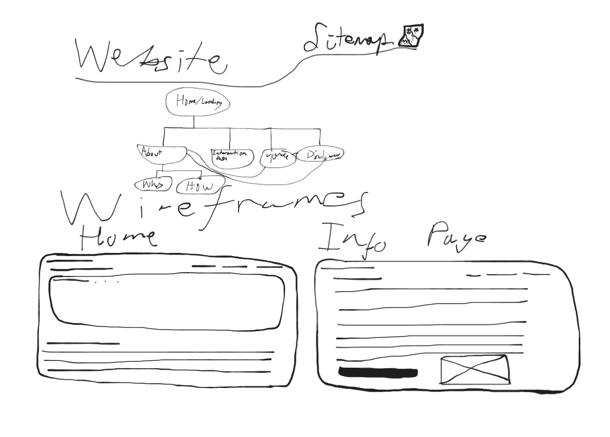

# **10 Computing Technology Assessment Task 2**

## ***Charles McDonagh***

## **Divergent Thinking**

**Mind Map**

**Table**

## **Convergent Thinking**

**Impact Effort Matrix**

**SWOT**

SWOTs done by Oscar Dodd.

**Conclusion**
Convergent Thinking Paragraph:
After thoughtful evaluation I have decided to pursue the not-AI, AI help app. I believe this will both provide a difficult coding challenge that obviously can be solved, and I think it tackles the issue in a humorous but also thoughtful way in order to influence people towards something to assist them.

CHOICE: Not-AI AI help app.

## **Functional Requirements**
**Functional Requirements**
- Provide information on AI, it's uses and consequences for communities, the environment, economy and society as a whole.
- "Act" like an AI to provide information to users, either through redirecting users to search engines that don't use AI, or through a human feedback loop.
- Look similar to an AI in order to properly attract AI users, by including design features common in artificial intelligence programs.
**Nonfunctional Requirements**
- Run without taking excess resources from the system to allow for the majority of modern computers to run the application.
- UX needs to be intuative and simple to allow for ease of access and 
- UI needs to look good, not just convincing as another AI slop app, and pleasing to the eyes.
# **Researching and Planning**
## **Explore Existing Ideas**
|Name| Plus   |      Minus      |  Implication |
|----------|----------|-------------|------|
|ChatGPT| ChatGPT was the first of the major AI firms, and their design reflects that somewhat.They were the originator of the AI question design, with a simple statement then a textbox for the starting query. Their design is relatively utilitarian, all buttons and points are clear, and little space is left unused without consideration. | ChatGPT has little flair, and entirely in black and white, is designed for a singular purpose. No space is left for decoration or much else of interest.  | ChatGPT is a classic artificial intelligence application, and to replicate this design would be wise to assist with fulfilling my requirements, at the same time I want to avoid the blandness of chatgpt, adding a more human centred look to my human centred design. |
|Gemini| Gemini did not let me into it's actual chat area, so the homepage will have to suffice. The design is simple, not overcrowded and it displays the marketing efforts gemini has been undertakening perfectly. | Gemini lacks in the design flair again. Everything is black and white, colour only pops from the logo and from the various rotating images on slideshow, advertising a service the user has already entered.|Again, Gemini provides a useful basis for the type of modern, corporate aesthetic I'm looking to follow for my UI, but it falls down in having any meaningful information areas that I can use.|
|Betoota Advocate| Comedy is subjective, but generally, I would consider the Betoota Advocate a funny outlet for news. It's this genre of satire comedy I wish to recreate with my application. The website itself is well organised and simple, a drawn back design based on a dual colour scheme. Writing is generally short and punchy, and focuses on packing "news stories" with as many jokes as possible, often self-referrential and developed around general societal trends and changes.| The Betoota Advocate's website, though not dated, is getting around to being older, and it sits far from my vision for my project, an entirelydifferent type of website to the one I aim to create. | The Betoota Advocate is perfect to inform the content, not design, of my webpage. The social commentary based on a deep level of satire provides the breadth of discussion that I aim to build my website around.|
## **Secondary Research**
Research information using data from at least 2-3 reputable sources.

Discuss your findings in two paragraphs or more and consider how they impact your project moving forward.

## **Primary Research**
I interviewed a grand total of 15 people for this assignment. Ranging in age from the elderly to children as young as a decade old, I attempt to get a general range of experiences from which I could learn about general opinions on AI in Australia. My full notes are sitting on a note app I can't access, but my general points remain the same.

- Everyone, young and old, was struggling more and more with identifying more modern AI in images. Of the 5 early AI (2023-2024) images I displayed, 95% were identified as AI. When it came to more modern images I created in early 2026, I found that only 30% were identified as AI. In addition, when compared with modern AI, a number of false positives, when people believed a real image to be AI, jumped drastically after I provided feedback on which images had and hadn't been AI.

- Especially in the older generations, 40+ being the cutoff point, AI generated text, compared to normal text, seemed to be less easy to identify. I didn't make use of early and later models of text, and models develop extremely quickly and adapt with the material they take in. I did however, find that 40+ year olds had a success rate of about 50% identifying AI text, whereas under 40s ranged from a success rate of 80% at the highest, to 40% at the lowest.

- Generally, older people were more likely to consider AI a "positive" or especially when prompted, a "gimmick" whereas younger people were a lot more likely to express negative feelings towards AI, and especially towards the expansion of AI further.

- The majority of participants stated that they used AI on the regular, though out of this group, only a minority would seek out AI advice, the others consuming from implicit artificial intelligence, like Google's search assistant.

This points, for the project, towards the fact that the majority of Artificial Intelligence use comes less from a pointed goal to make use of AI, but rather from the current state of AI being so integrated into society, users don't have choices when it comes to taking their information from any modern mainstream search engines for any questions. 

## **UI / UX Design**

## **Prototype**

https://www.figma.com/proto/dWH1NY8WUFl41OTREsXD8v/10CT-Tasktuah-%22Figma%22?node-id=4-40&t=VGFcwPERP3JODbpV-1 

# **Testing and Evaluating**

## **Project Evaluation**

I believe I have succeed in the goals I laid out for my project thusfar, and have developed a application well poised to project positive influence combatting the 