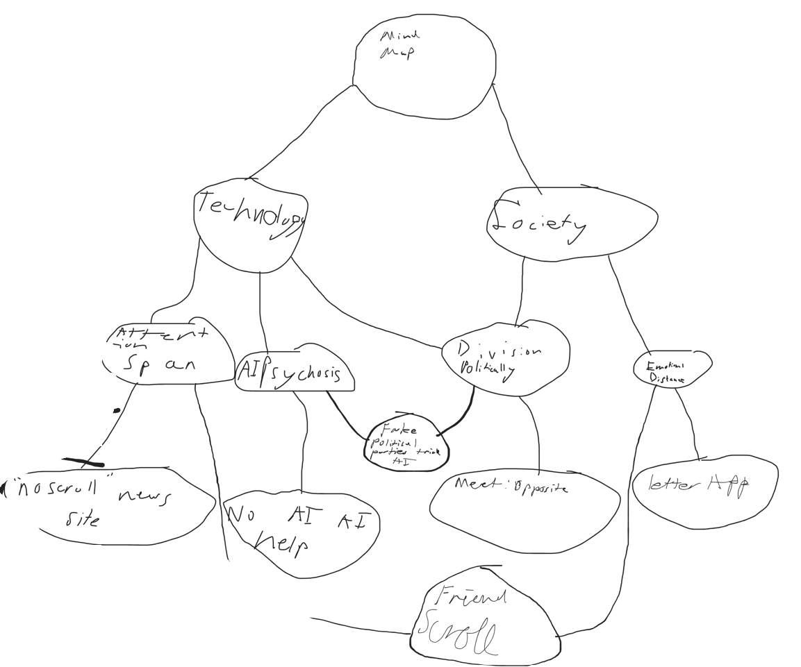
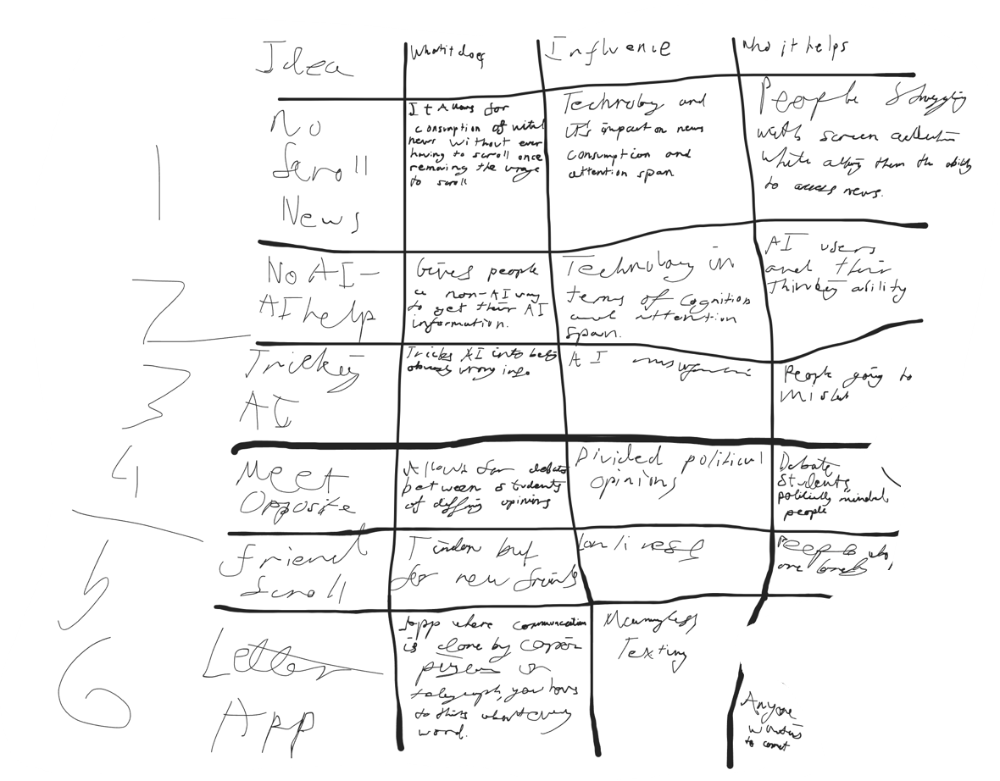
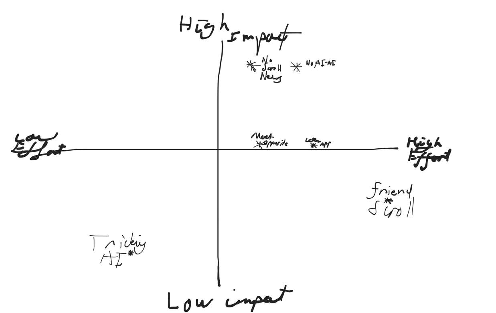
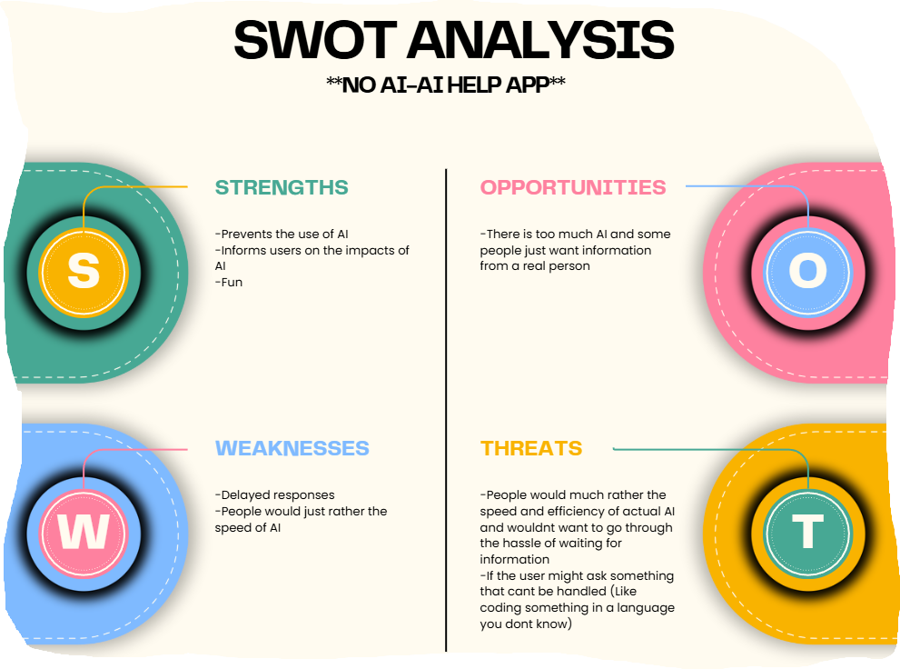
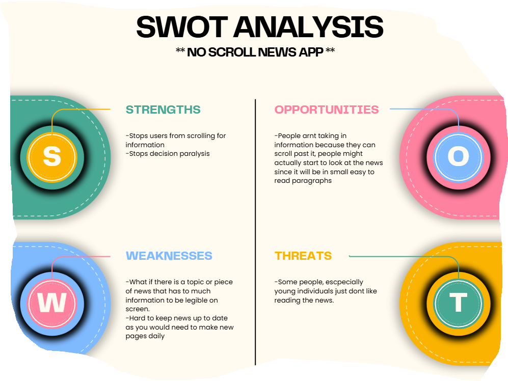

# **10 Computing Technology Assessment Task 2**

## ***Charles McDonagh***

## **Divergent Thinking**

**Mind Map**

**Table**

## **Convergent Thinking**

**Impact Effort Matrix**

**SWOT**

SWOTs done by Oscar Dodd.

**Conclusion**
Convergent Thinking Paragraph:
After thoughtful evaluation I have decided to pursue the not-AI, AI help app. I believe this will both provide a difficult coding challenge that obviously can be solved, and I think it tackles the issue in a humorous but also thoughtful way in order to influence people towards something to assist them.

CHOICE: Not-AI AI help app.

## **Functional Requirements**

**Functional Requirements**

**Nonfunctional Requirements**

# **Researching and Planning**
## **Explore Existing Ideas**
Research at least three websites / web applications which are used to influence people. Evaluate each with a PMI (Plus, Minus, Implications) table.

## **Secondary Research**
Research information using data from at least 2-3 reputable sources.

Discuss your findings in two paragraphs or more and consider how they impact your project moving forward.

## **Primary Research**
Conduct primary research into your topic. Consider your target market and gather information through surveys, questionnaires and/or interviews. Make sure to include questions to gather quantitative and qualitative data.

Organise your data (e.g. quantitative into spreadsheet / qualitative into .md file)

Evaluate your findings and consider how it impacts your project moving forward.

## **UI / UX Design**
Generate and evaluate alternative designs using website wireframes and webpage storyboards. You may do this on paper or using Adobe XD / Figma.

## **Prototype**
Create a prototype of at least your home page and one another page from your website using Figma, Adobe XD or a web content management system (CMS).

